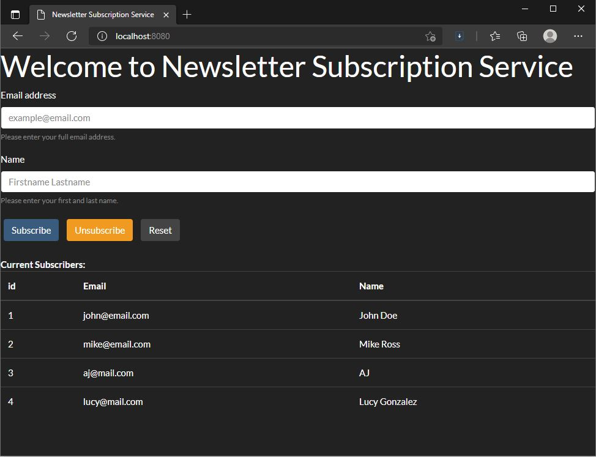

# Java III Newsletter Subscription Service Project

## Introduction
The project uses the sample code (https://github.com/jcrogel/JAVAIII_Class9) as a reference. 
The system prompts for an email address and a name, then it will add them to the list.
There are two ways to subscribe/unsubscribe a user into the list.  

The project uses H2 database in the memory so that it does not require local MySQL server running
 or local storage. However, the database does not preserve the data. It is possible to view the
 content of the database using the following URL and information: 

http://localhost:8080/h2-console
- JDBC URL: jdbc:h2:mem:testdb
- User Name: sa
- Password : password

## Web page
The first is to interact using the webpage. Please visit:

http://localhost:8080/

By filling out the information and clicking the buttons, you will be able to add or remove yourself from the list.

At the bottom of the page, there is a table showing all entries in the system.  

There are two known issues:
- While the web page checks for a valid email input, empty inputs can be passed into the system.
- The system does not know if an entry is actually removed from the database
## URL
It is also possible to use HTTP GET request to interact with the system. Please you the following format:

### Subscribe:
http://localhost:8080/subscribe?email=EMAIL&name=NAME   
### Unsubscribe:  
http://localhost:8080/unsubscribe?email=EMAIL&name=NAME  
### List all entries:    
http://localhost:8080/list

Please note that it will not check for correct formatting or invalid input. 

## Screenshot
